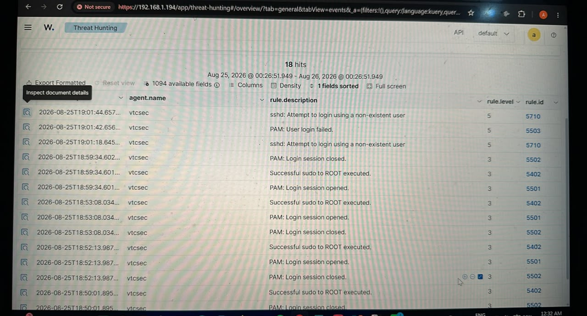

# Incident 001 – SSH Failed Login Attempt

## Incident Summary

A failed SSH authentication attempt was detected by Wazuh during testing of my SOC home lab. The authentication attempt targeted a non-existent user account named `fakeuser`.

The event was generated intentionally in my authorized lab environment to practice security monitoring, alert investigation, and incident documentation.

## Alert Information

- **SIEM:** Wazuh
- **Agent:** vtcsec
- **Event Source:** SSH / sshd
- **Source IP:** 127.0.0.1
- **Attempted Username:** fakeuser
- **Event Type:** Failed SSH authentication
- **Environment:** SOC Home Lab
- **Status:** Investigated
- **Severity:** Low

## Detection

Wazuh detected the SSH authentication failure and generated security alerts including:

- `sshd: Attempt to login using a non-existent user`
- `PAM: User login failed`

The event appeared in the Wazuh Threat Hunting interface.

## Investigation

I reviewed the alert in Wazuh and examined the associated event fields.

Important fields included:

- `agent.name: vtcsec`
- `data.srcip: 127.0.0.1`
- `data.srcuser: fakeuser`
- `decoder.name: sshd`

The log showed a failed password attempt against the non-existent `fakeuser` account.

Because the source address was `127.0.0.1`, the authentication attempt originated from the monitored host itself.

## Analysis

The activity was generated intentionally as part of an authorized cybersecurity lab exercise.

In a production SOC environment, repeated failed SSH authentication attempts could indicate:

- Brute-force activity
- Password guessing
- Account enumeration
- Unauthorized access attempts
- Compromised credentials

A SOC analyst should correlate the event with additional authentication attempts, source IP reputation, affected systems, successful logins, and other related alerts before determining the final severity.

## MITRE ATT&CK

This type of authentication activity may be investigated in the context of:

- **Tactic:** Credential Access
- **Technique:** T1110 – Brute Force

A single failed login alone does not prove a brute-force attack. Additional repeated authentication attempts would be required to establish that behavior.

## Response

For this lab event:

1. Reviewed the Wazuh alert.
2. Identified the source IP and attempted username.
3. Verified that `fakeuser` was intentionally used for testing.
4. Confirmed the activity originated from localhost.
5. Determined that no production system was affected.
6. Documented the investigation.

## Conclusion

**Classification:** Benign / Authorized Security Test

**Impact:** None

**Final Status:** Closed

This exercise demonstrated the basic SOC workflow:

**Generate Event → Detect → Investigate → Analyze → Classify → Document**

## Evidence

### Evidence 1 - Wazuh Threat Hunting Alerts

The Wazuh Threat Hunting dashboard recorded the SSH authentication activity generated during the authorized lab test. Multiple security events were observed, including failed authentication attempts and an attempt to authenticate using a non-existent user.

### Evidence 2 - Wazuh Alert Details

Reviewing the individual Wazuh event confirmed the following indicators:

- **Source IP:** 127.0.0.1
- **Attempted Username:** fakeuser
- **Service:** SSH / sshd
- **Activity:** Failed authentication for an invalid user
- **Host/Agent:** vtcsec
- **Environment:** Authorized SOC home lab

The source address `127.0.0.1` indicates that the authentication attempt originated from localhost. The username `fakeuser` was intentionally used to trigger and investigate the alert.

## Analyst Assessment

The alert was investigated and determined to be a **true positive security detection generated by authorized testing**. Wazuh successfully detected the failed SSH authentication activity and provided sufficient event information for investigation.

No evidence of unauthorized external access or compromise was identified during this exercise.

**Disposition:** Benign / Authorized Security Test  
**Impact:** None  
**Incident Status:** Closed
