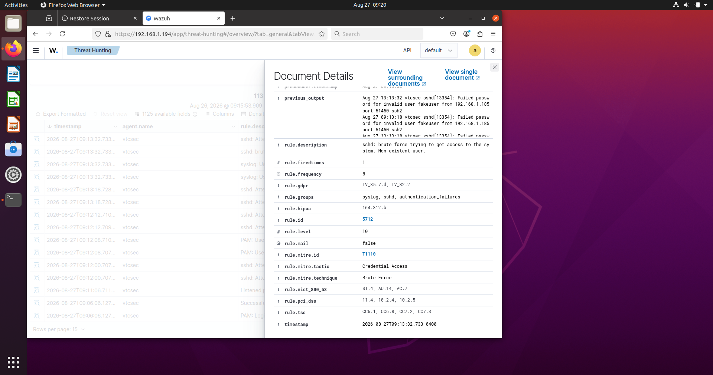
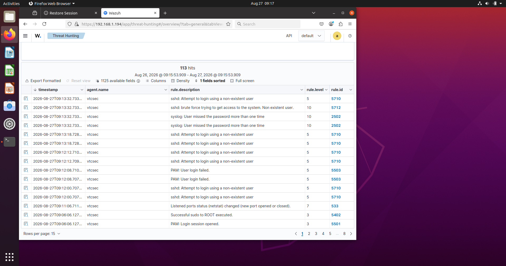

# SSH Brute-Force Detection with Wazuh

## Overview

This lab demonstrates the detection and investigation of an SSH brute-force attack in a controlled cybersecurity home lab environment.

Multiple failed SSH authentication attempts were generated from a Kali Linux machine against an Ubuntu system monitored by Wazuh. Wazuh detected the repeated authentication failures, correlated the events, and generated a Level 10 security alert.

## Lab Environment

- SIEM/XDR: Wazuh
- Target System: Ubuntu Linux
- Attack Simulation System: Kali Linux
- Attack Protocol: SSH
- Log Source: `/var/log/auth.log`
- Wazuh Decoder: `sshd`

## Attack Simulation

Repeated SSH login attempts were made using a non-existent account:

`fakeuser`

The authentication attempts failed and generated SSH authentication events on the monitored Ubuntu system.

## Wazuh Detection

Wazuh detected several related security events, including:

- `sshd: Attempt to login using a non-existent user`
- `syslog: User missed the password more than one time`
- `sshd: brute force trying to get access to the system. Non existent user.`

The correlated brute-force activity generated a:

**Wazuh Alert Level: 10**

**Rule ID: 5712**

## MITRE ATT&CK Mapping

Wazuh mapped the detected activity to:

- MITRE ATT&CK ID: `T1110`
- Tactic: `Credential Access`
- Technique: `Brute Force`

## Investigation

During analysis of the Wazuh alert, the event details showed repeated failed SSH authentication attempts associated with the username:

`fakeuser`

The source address recorded by the SSH event was:

`192.168.1.185`

The repeated failures caused Wazuh to correlate the authentication events and escalate the activity to a Level 10 brute-force alert.

## SOC Analyst Assessment

The activity is consistent with an SSH brute-force attempt against a non-existent user account.

In a production environment, recommended response actions would include:

1. Investigating the source IP and affected host.
2. Reviewing surrounding authentication events for successful logins.
3. Determining whether other usernames or systems were targeted.
4. Blocking or restricting the source if confirmed malicious.
5. Reviewing SSH configuration and authentication controls.
6. Escalating the incident if evidence of compromise is discovered.

## Outcome

## Evidence

### Wazuh SSH Brute-Force Alert

### Failed SSH Login Evidence

### Brute-Force Events Overview

The lab successfully demonstrated:

- Linux authentication log monitoring
- SSH attack detection
- Wazuh event correlation
- Alert investigation
- Severity analysis
- MITRE ATT&CK mapping
- Basic SOC incident assessment

> This activity was performed in an isolated, authorized home-lab environment for cybersecurity training purposes.
