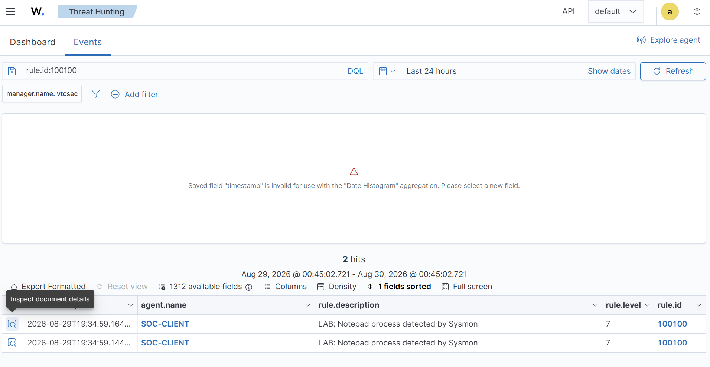
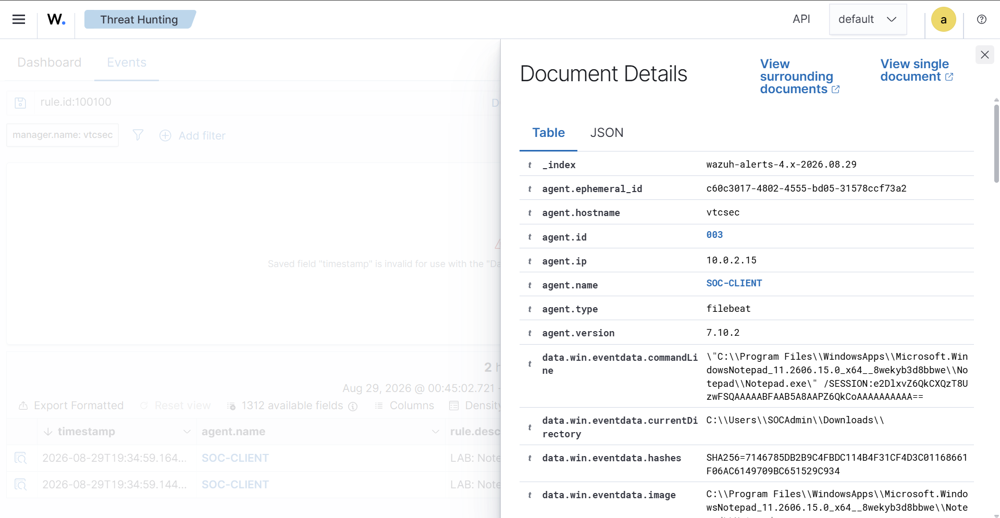
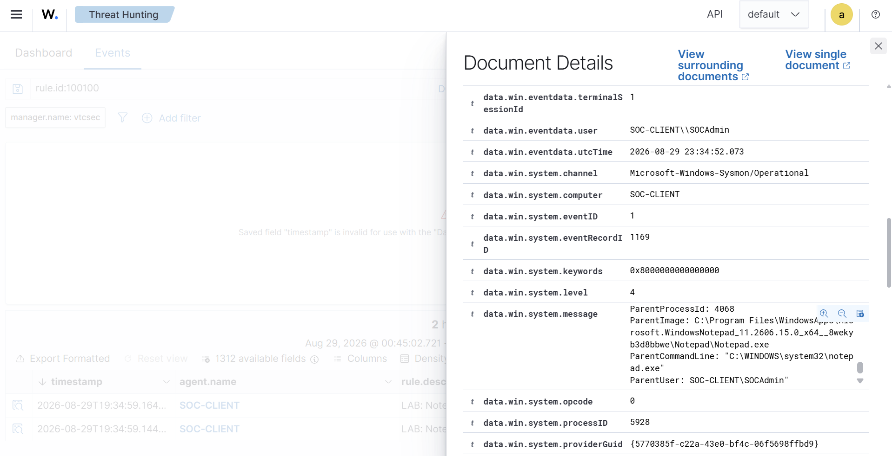

# Wazuh Sysmon Notepad Detection Lab

## Objective
Create and test a custom Wazuh detection rule that identifies Notepad process creation events collected from a Windows endpoint using Sysmon.

## Lab Environment
- Wazuh Manager: Ubuntu Linux
- Windows endpoint: WINDOWS-SOC
- Endpoint telemetry: Sysmon
- SIEM/XDR: Wazuh
- Virtualization: Oracle VirtualBox

## Detection Rule
A custom Wazuh rule was created to detect the execution of `notepad.exe` from Windows Sysmon Event ID 1 process creation events.

- Rule ID: 100100
- Rule Level: 7
- Groups: sysmon, windows
- Detection: Notepad process execution

## Detection Logic

The custom rule monitors Sysmon process creation events and matches the Windows image field when `notepad.exe` is executed.

## Test Procedure
1. Verified that the Windows Wazuh agent was connected.
2. Verified that Sysmon was running on the Windows endpoint.
3. Executed Notepad on the Windows machine.
4. Confirmed that Sysmon generated the process creation event.
5. Verified that Wazuh received the Windows event.
6. Confirmed that custom Rule ID 100100 triggered successfully.

## Result

Wazuh successfully generated the custom alert:

**LAB: Notepad process detected by Sysmon**

The alert was generated at **Level 7** under custom **Rule ID 100100**.

## Skills Demonstrated
- Wazuh SIEM administration
- Windows endpoint monitoring
- Sysmon telemetry analysis
- Custom detection rule development
- Log analysis
- Threat hunting
- SOC alert validation

## Conclusion
This lab demonstrates an end-to-end detection workflow from Windows Sysmon telemetry to a custom Wazuh security alert.

## SOC-CLIENT Detection Evidence

The detection was successfully validated on the SOC-CLIENT Windows endpoint.

### Wazuh Alert

### Process Details

### Sysmon Event ID 1

